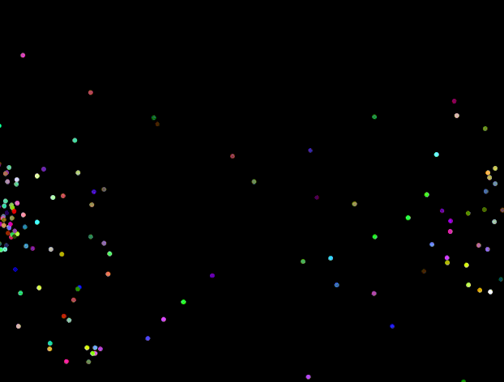

# n-body-problem

An animation of many gravitationally bound point masses.



## Build
```
make
```
then
```
./n-body
```

Change the number of entities, gravitational constant, smoothing constant, and simulation delta at the top of [main.c](./main.c).

## References

- [Gravitional Softening](https://arxiv.org/pdf/1205.2729)

## Requirements

- [sdl2](https://www.libsdl.org/)
- [pkg-config](https://www.freedesktop.org/wiki/Software/pkg-config/)
